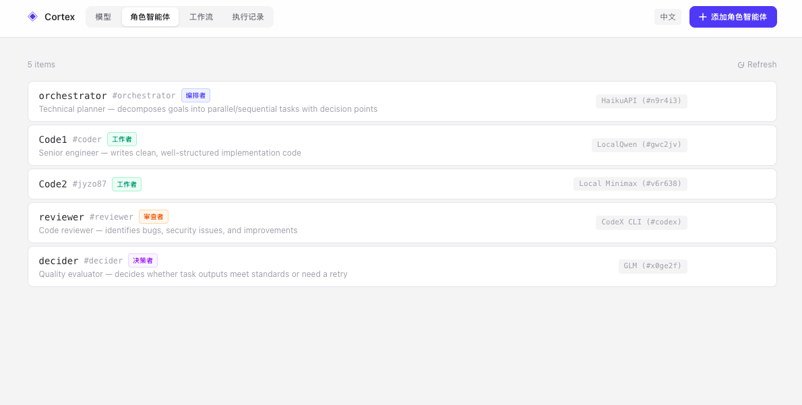
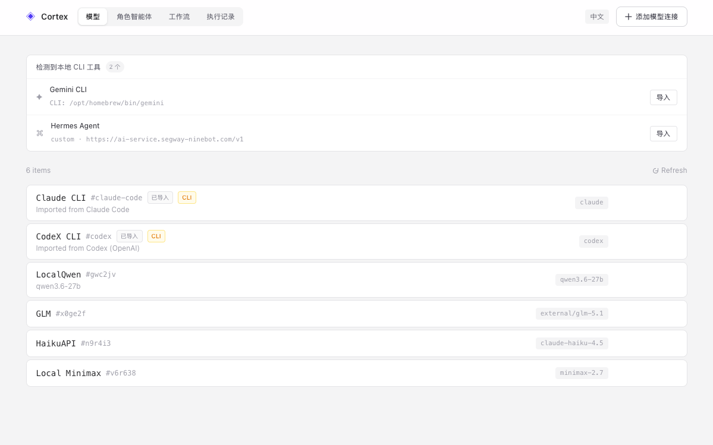
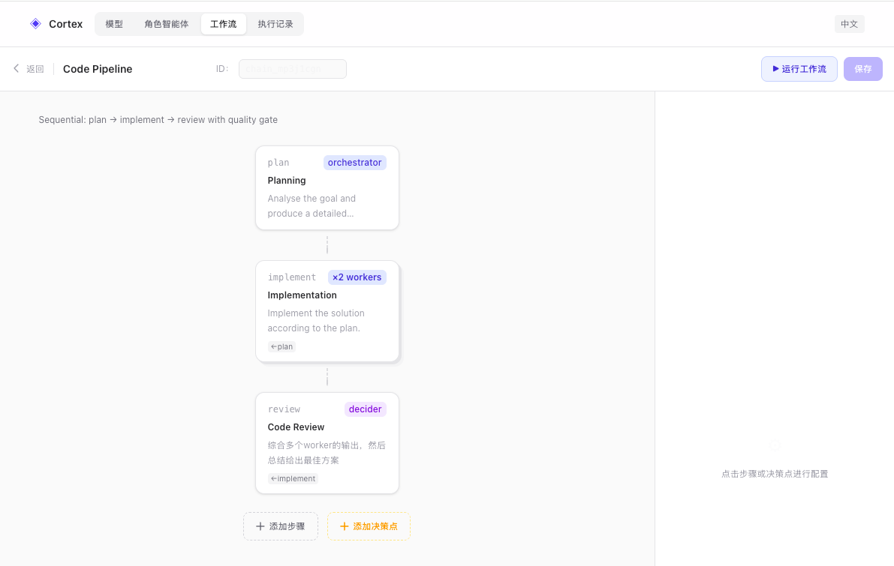

# Cortex

A multi-agent CI engine that composes AI models into visual pipelines with parallel execution, quality gates, and real-time streaming.


<p align="center">
  
</p>

## Overview

Cortex orchestrates multiple AI agents (Claude, Codex, Gemini, local models, custom OpenAI-compatible APIs) into configurable pipelines. Each pipeline is a DAG of tasks that run sequentially or in parallel, with optional quality-check decision points.

**Core capabilities:**

- **Model hub** — auto-detect installed CLI tools (Claude Code, Codex, Gemini, Hermes), connect any OpenAI-compatible API or self-hosted model
- **Role agents** — define specializations (Orchestrator, Worker, Reviewer, Decider) bound to model connections
- **Visual pipeline builder** — design task graphs with parallel workers and decision checkpoints
- **Real-time execution** — SSE streaming of task lifecycle and tool-call events
- **Run history** — every execution persisted with full tool-call timeline
- **CLI + Web** — run pipelines from the terminal or the browser

### Screenshots

**Model Connections** — auto-detect local CLI tools, manage API providers

<p align="center">
  
</p>

**Role Agents** — define agents by role (Orchestrator, Worker, Reviewer, Decider) with system prompts

<p align="center">
  
</p>

## Quick Start

```bash
npm install
npm run dev       # backend API server
npm run web:dev   # web UI (separate terminal)
```

Open http://localhost:47823 for the web interface.

> On first run, Cortex auto-initializes `agents.yaml` and `pipelines.yaml` from the bundled example templates.

## Architecture

```
┌─────────────────────────────────────────────────────────┐
│                     Web UI (React)                       │
│  ┌──────────┐  ┌──────────┐  ┌──────────┐  ┌────────┐  │
│  │  Models  │  │   Roles  │  │Pipeline  │  │  Runs  │  │
│  └──────────┘  └──────────┘  └──────────┘  └────────┘  │
└──────────────────────┬──────────────────────────────────┘
                       │ REST + SSE
┌──────────────────────▼──────────────────────────────────┐
│                Express API Server                        │
│  /api/agents  · /api/pipelines  · /api/runs  · /api/importers │
└──────────────────────┬──────────────────────────────────┘
                       │
┌──────────────────────▼──────────────────────────────────┐
│                  Core Engine                             │
│  ┌──────────┐  ┌──────────┐  ┌──────────┐              │
│  │  Agent   │  │Orchestrator│  │  Runner  │              │
│  └──────────┘  └──────────┘  └──────────┘              │
└─────────────────────────────────────────────────────────┘
                       │
         ┌─────────────┼─────────────┐
         ▼             ▼             ▼
    Claude API    OpenAI Compat   CLI (claude, codex)
```

## Concepts

| Concept | Description |
|---------|-------------|
| **Model Connection** | Provider config — Claude, OpenAI-compatible API, or CLI tool |
| **Role Agent** | A specialization (Orchestrator / Worker / Reviewer / Decider) with a system prompt, bound to a model connection via `baseAgent` |
| **Pipeline** | A DAG of tasks. Each task assigns one or more agents and declares `dependsOn` for sequencing |
| **Decision Gate** | A quality checkpoint between tasks — a Decider agent reviews output and can trigger retries |
| **Run** | A pipeline execution record with per-task output and tool-call timeline, persisted as JSON |

## CLI Usage

```bash
# Interactive pipeline picker
cortex run

# Run a specific pipeline
cortex run <pipeline-id> "<goal>"

# List all pipelines
cortex run --list
```

## Pipeline Configuration

Pipelines are defined in `pipelines.yaml`. Each task specifies the agent(s), input prompt, and dependencies:

```yaml
pipelines:
  code_pipeline:
    name: Code Pipeline
    description: 'Plan → implement in parallel → review with quality gate'
    tasks:
      - id: plan
        name: Planning
        agent: orchestrator
        input: Analyse the goal and produce a detailed implementation plan.
        dependsOn: []
      - id: implement
        name: Implementation
        agent: [coder, coder2]       # parallel workers
        input: Implement the solution according to the plan.
        dependsOn: [plan]
      - id: review
        name: Code Review
        agent: reviewer
        input: Review all outputs and produce a final summary.
        dependsOn: [implement]
    decisions: []
```

Key features:
- **Parallel workers** — `agent` as an array runs multiple agents simultaneously
- **Sequential flow** — `dependsOn` chains tasks
- **Decision gates** — `decisions[]` adds quality checkpoints with automatic retry

See [pipelines.example.yaml](pipelines.example.yaml) for complete examples including research and parallel pipelines.

## Agent Configuration

Agents are defined in `agents.yaml`:

```yaml
# Model connection
claude-code:
  name: Claude CLI
  provider:
    type: cli
    command: claude

# Role agent bound to a model
orchestrator:
  name: Orchestrator
  role: orchestrator
  system: |
    You are a technical planner. Decompose goals into parallel/sequential tasks...
  baseAgent: claude-code
```

See [agents.example.yaml](agents.example.yaml) for a fully commented template.

## API Endpoints

| Method | Path | Description |
|--------|------|-------------|
| `GET` | `/api/agents` | List all agents |
| `POST` | `/api/agents` | Create agent |
| `PUT` | `/api/agents/:id` | Update agent |
| `DELETE` | `/api/agents/:id` | Delete agent |
| `GET` | `/api/pipelines` | List pipelines |
| `POST` | `/api/pipelines` | Create pipeline |
| `PUT` | `/api/pipelines/:id` | Update pipeline |
| `POST` | `/api/pipelines/:id/run` | Execute pipeline (SSE stream) |
| `GET` | `/api/runs` | List recent runs |
| `GET` | `/api/runs/:id` | Run detail with tool-call timeline |
| `GET` | `/api/importers` | Detect local CLI tools |

### SSE Events

Pipeline execution streams real-time events:

```
task:start         → task began
task:tool_event    → tool call during execution
task:complete      → task finished with output
decision:start     → quality gate triggered
decision:complete  → decision result (continue / retry)
complete           → pipeline finished
error              → execution error
```

## Tool Call Timeline

For CLI providers, use `--output-format stream-json` to capture detailed tool call events:

```yaml
provider:
  type: cli
  command: claude
  args:
    - --system-prompt
    - '{{SYSTEM}}'
    - -p
    - '{{PROMPT}}'
    - --output-format
    - stream-json
```

Run records with `text` output still persist task results, but without per-tool-call detail.

## Project Structure

```
cortex/
├── src/
│   ├── index.ts           # CLI entry point
│   ├── core/              # Agent, Orchestrator, Plan, Runner
│   ├── server/            # Express API + SSE
│   └── providers/         # Model provider implementations
├── web/
│   └── src/               # React SPA (Vite)
├── agents.example.yaml    # Agent config template
├── pipelines.example.yaml # Pipeline config template
└── runs/                  # Execution history (git-ignored)
```

## Scripts

| Command | Description |
|---------|-------------|
| `npm run dev` | Start backend API server |
| `npm run web:dev` | Start web UI dev server |
| `npm run web` | Build web + start production server |
| `npm run build` | TypeScript compilation |
| `npm run typecheck` | Type check without emitting |
